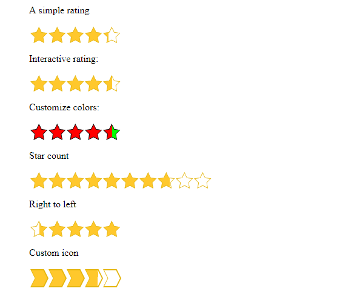

# React star review
[](http://npm.im/react-star-review)
[](http://npm-stat.com/charts.html?package=react-star-review&from=2018-04-03)
[](https://github.com/semantic-release/semantic-release)
[](https://travis-ci.org/SahajR/react-star-review)

A simple and customizable rating component for React


View the [demo](https://reviews.demos.sahajr.com).

## Install
```js
npm install react-star-review
// or
yarn add react-star-review
```

## Props

| Prop | Type | Description | Default |
| ------ | ------ | ------ | ------ |
| size | Number | Size of a star in px | 30 |
| rating | Number | Initial rating  | 0 |
| rtl | Boolean | Rating behaves in right-to-left direction | false |
| interactive | Boolean | If true, users can change a rating. Must also provide `onRatingChanged` | false |
| onRatingChanged | Function | Callback when rating changes | null |
| icon | String | A valid CSS Basic shape to be used as a mask for ratings | Star |
| count | Number | Number of stars, aka the scale | 5 |
| borderThickness | Number | The stars' border thickness | 2 |
| filledColor | String | Color used to fill the star |  |
| clearColor | String | Color used to indicate the empty areas of the star |  |
| borderColor | String | The stars' border color |  |
| hoverColor | String | Color used to fill when a user hovers over them |  |


## Todos
- [x] Add support for right-to-left
- [x] Add support for custom icons
