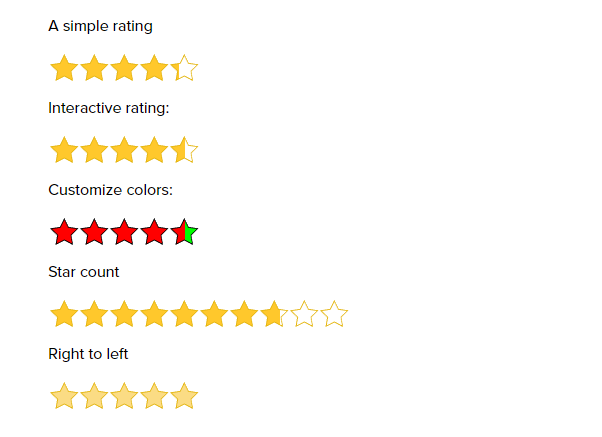

# React simple rating
A simple and customizable rating component for React

## Props

| Prop | Type | Description | Default |
| ------ | ------ | ------ | ------ |
| size | Number | Size of a star in px | 30 |
| rating | Number | Initial rating  | 0 |
| interactive | Boolean | If true, users can change a rating. Must also provide `onRatingChanged` | false |
| onRatingChanged | Function | Callback when rating changes | null |
| count | Number | Number of stars, aka the scale | 5 |
| borderThickness | Number | The stars' border thickness | 2 |
| filledColor | String | Color used to fill the star | #FFC82C |
| clearColor | String | Color used to indicate the empty areas of the star | #FFF |
| borderColor | String | The stars' border color | #E4B50E |
| hoverColor | String | Color used to fill when a user hovers over them | #FBDC84 |

## Todos
- [ ] Add support for right-to-left
- [ ] Add support for custom icons
